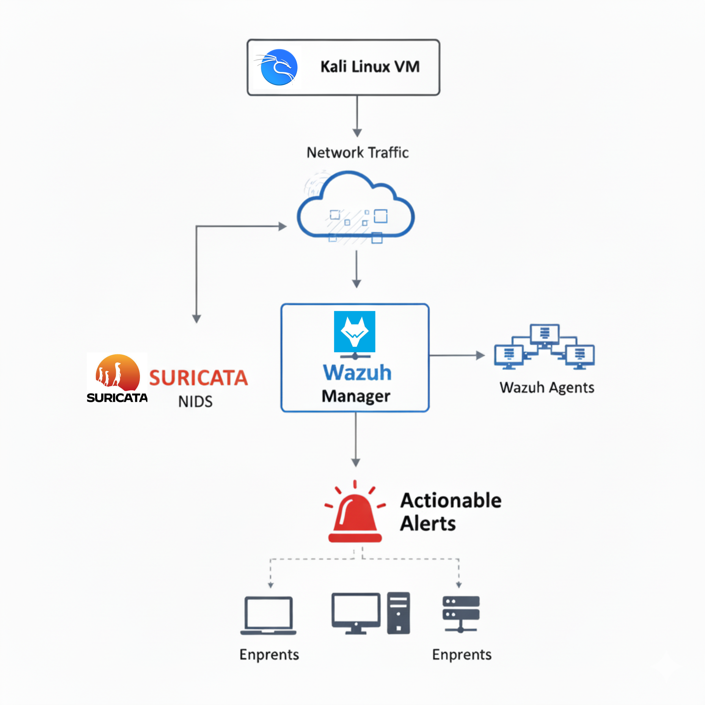

# 🛡️ Open-Source SOC Monitoring Environment 

This repository presents the project I completed during my cybersecurity internship at Attijari Bank, where I deployed a host-based and network-based intrusion detection environment using open-source tools.  
The objective was to strengthen my defensive security skills and implement a functional monitoring pipeline capable of detecting common attack techniques.

# 🛡️ Open-Source SOC Monitoring Environment

  <!-- Project Identity -->
  

  <!-- Virtual Machines -->
  
  

  <!-- Tools Used -->
  
  

  <!-- Category & Status -->
  
  

### 🚀 Project Scope
---

## 🏗️ Lab Setup & Architecture

- **Wazuh Manager** —> SIEM & HIDS  
- **Wazuh Agents** —> Host log collection & monitoring  
- **Suricata** —> Network IDS  
- **Kali Linux VM** —>  Attack simulation  
- **Virtualization Platform** —> VMware / VirtualBox

 ## 🗺️ SOC Lab Topology

## ✔️ Completed Work

This SOC foundation integrates two core components:

#### 🔸 Wazuh — SIEM / Host-Based Intrusion Detection (HIDS)
- Deployment of Wazuh Manager
- Installation and configuration of Wazuh agents
- Log collection and correlation
- Real-time alerting based on host behavior (file integrity, authentication, privilege use, etc.)

#### 🔸 Suricata — Network Intrusion Detection System (NIDS)
- Deployment and integration with the monitoring environment
- Custom rule creation (DoS detection, port scanning signatures, suspicious traffic patterns)
- Packet inspection and alert generation
- Validation using simulated attacks from Kali Linux

## 🧪 Testing & Validation

- Network scans (Nmap)
- Suspicious traffic injections
- Host-level event triggering (authentication failures, file modifications)

**Results:** Wazuh + Suricata provided clear, actionable alerts, demonstrating strong detection capabilities in a lab environment.

## 🔮 Future Enhancements (Planned)

- Foundation for a full SOC (not implemented during internship)  
- **TheHive:** Incident response and case management  
- **Cortex:** Automated analysis and task execution  
- **MISP:** Threat intelligence enrichment  
- **SOAR:** Automated response playbooks

These enhancements would transform the monitoring environment into a complete SOC ecosystem.

## 🎯 Skills Gained
- Defensive monitoring & intrusion detection
- SIEM configuration (Wazuh)
- NIDS rule development (Suricata)
- Linux system administration
- Virtualized SOC lab design
- Attack simulation & detection validation
- Cybersecurity documentation
